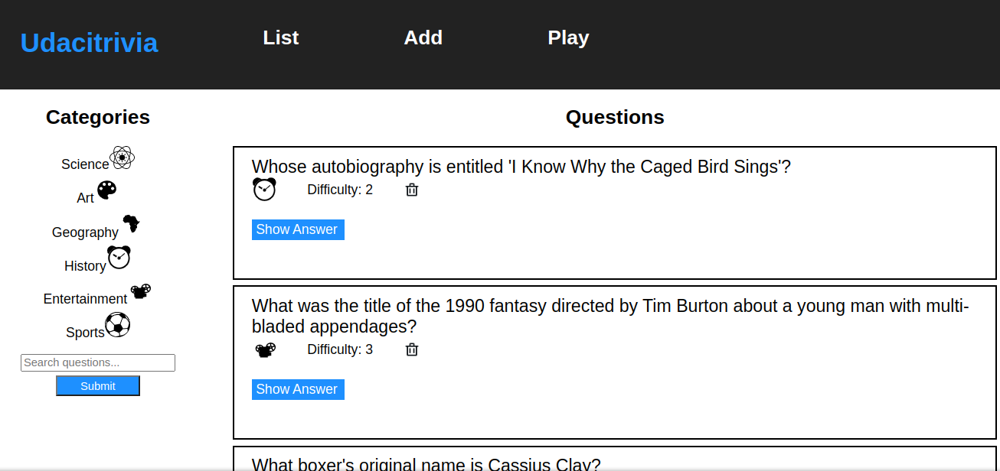

# Trivia

Trivia web application is a trivia game running on the web. Students and/or competitors are asked questions about interesting but unimportant subjects. Students can take questions from a certain category or from all category play the trivia game.

## Code style
Code style follows the PEP8 style guide

# Getting Started

## Prerequisites

- Nodejs - Install nodejs to run the React frontend library and npm ( a package manager for nodejs applications)

- Python3 - Install python3 to run backend code. Python3.7 and above is recommended ( and pip or pip3 a package manager for installing python libraries)

## Installations

### Backend

In order to install backend dependencies and run the server, do the following

- Run move into the backend directory by running the `cd backend` provided you are in the Trivia directory

- Run `pip3 install -r requirements.txt` to install all dependencies for the backend.

- In order to setup the postgresql database in your system, 

    1. `sudo -u postgres -i` to login into postgresql environment. (you will be asked to enter credendials for your computer)

    2. `dropdb trivia & createdb trivia` to create the trivia database.

    3. In the postgres database terminal, run the command 

        `\i ./tivia.psql` to setup database tables and populate the tables with data.
    
-Start the backend server by running `FLASK_APP=flaskr FLASK_DEBUG=1 flask run`

- In order to run backend tests,
    
    - Install `unittest` flask unit test library
    - Run `python3 -m test_flaskr --verbose`

If the backend test runs successfully then you are good to go.

### Frontend

- Move into the frontend directory

- Run `npm install` to install frontend dependencies (This command should be run only once)

- Start the frontend server by running `npm start`

# API Documentation

